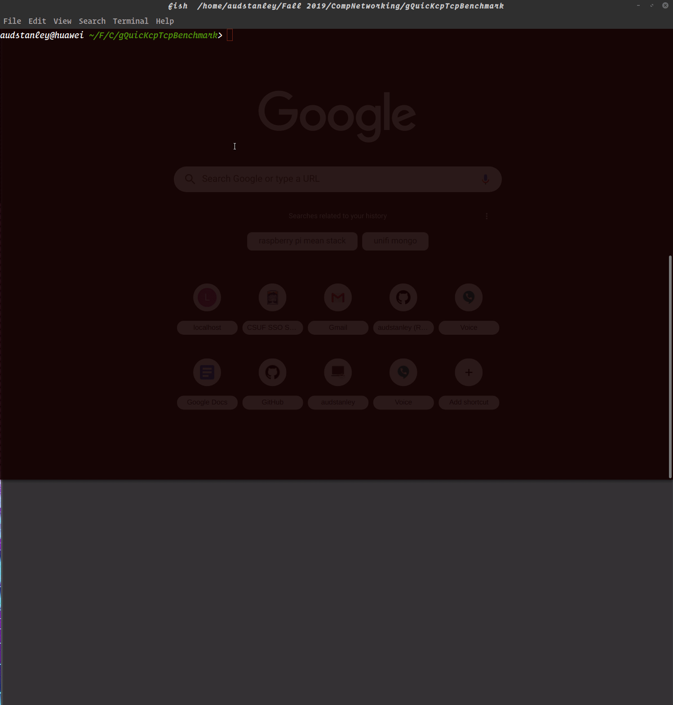

# gQuicKcpTcpBenchmark

This application runs a benchmark against gQUIC, KCP, and TCP protocols.

## To get started, you must run a derivative Linux OS, the binaries for KCP Tun are amd_x64 based. You will also need google chrome installed, and at a minimum Node v8+. This is currently tested on Node v13.

```bash
# install http-server globally
sudo npm i -g http-server;
git clone https://github.com/audstanley/gQuicKcpTcpBenchmark;
cd gQuicKcpTcpBenchmark/;
npm i;
npm run start-both; # this will run all tests locally

```

Upon completetion, google chrome will open up, and display the results from the local test.


